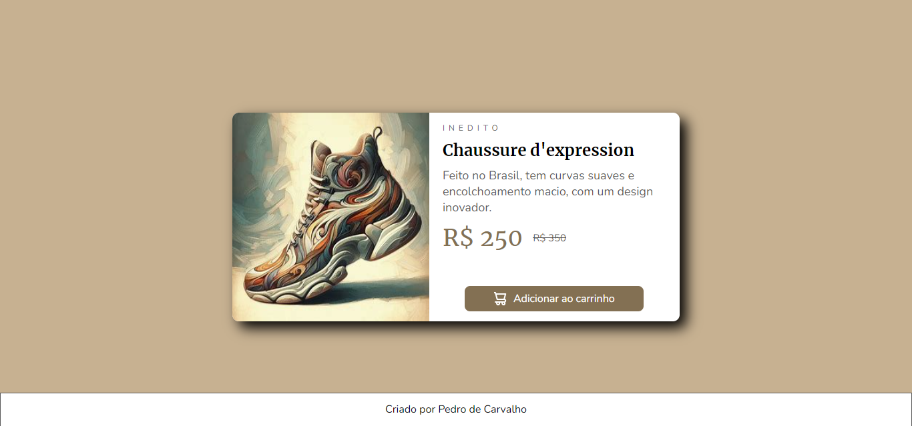
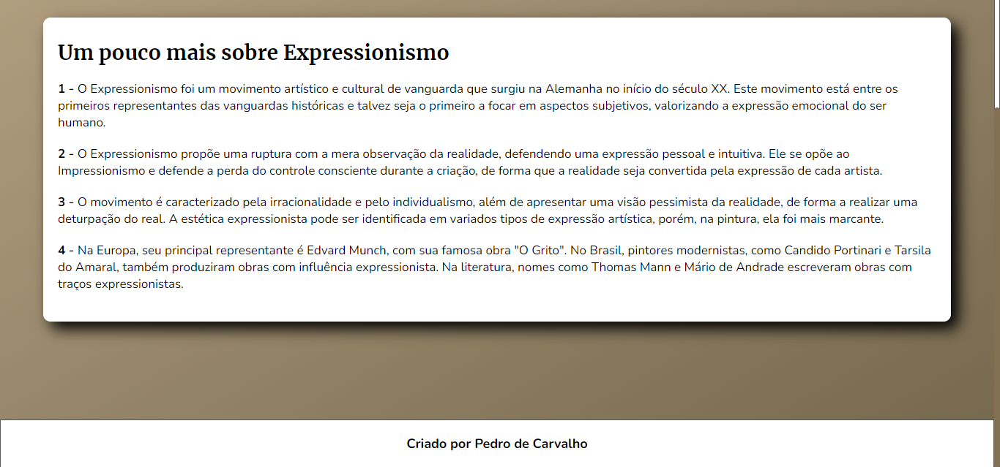

# Loja de sapatos.

## Bem-vindo! 👋
Obrigado por ver meu projeto!

## Descrição do projeto 😀
Esse projeto aborda sobre um site de sapatos que está inovando com um novo sapato, fiz ele com total autoria, e eu permito a cópia de imagens e códigos do site.

## Como os usuários podem utilizá-lo?
Clicando no botão adicionar ao carrinho!

## Tem algum feedback? 😁
Adoro receber feedbacks! Estou sempre buscando melhorar meus projetos. Então, se você tiver algo que gostaria de mencionar, envie um e-mail para evex12324@gmail.com!

## Tecnologias utilizadas
As classes ou tags mais importantes utilizadas foram:
Âncora
Responsividade
Img
Bing (Para pegar a imagem)

## Contribuidores
Bing (Para pegar a imagem)

## Autor do projeto.
Pedro de Carvalho

**Compartilhe este repositório!** 🚀
